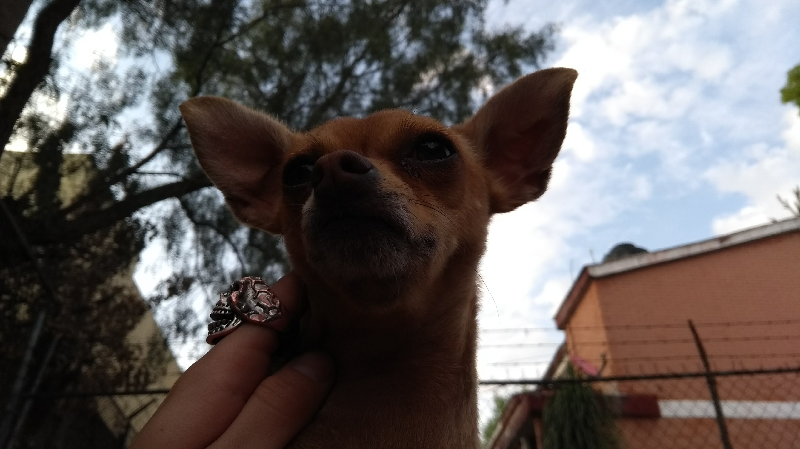

# Donna  
Donna follows the hundreds of projects using the [Pix2Pix architecture](https://arxiv.org/abs/1611.07004) for solving Image-to-Image Translation tasks. 
This tasks are incredibly varied, from conventional Pix2Pix  uses as the one presented [here](https://github.com/javirk/Person_remover)
by [javirk](https://github.com/javirk), which is used to remove people from images and videos, to this unconventional one [here](https://github.com/hmartelb/Pix2Pix-Timbre-Transfer)
by [hmartelb](https://github.com/hmartelb), transfering the timbre from audio by first transforming the audio into an image.  
Donna follows a conventional path, as we're just starting to get to know the Pix2Pix architecture, and Deep Learning for that matter. 
The idea is pretty simple, taking a bad resolution picture from a pet and translating it to one with better resolution, as the example below.  

By the way, the data comes from [The Oxford-IIIT Pet Dataset](https://www.robots.ox.ac.uk/~vgg/data/pets/), but we had to do some minor modifications in order 
to be able to use it smoothly, this modifications are shown in the [rotenning images script](https://github.com/RicFraga/Donna/blob/main/Creating%20dataset/Rotting%20Images.ipynb).  

Also, the repo is named after my dog, because she also takes something crappy and transforms it into something pretty  :doughnut:.  

# Preprocessing the images  
There are so many different ways in which images can be preprocessed for our purpose, we used a very simple one. We wanted the images to look as realistically bad as they could, we observed that in low quality cameras the images tend to be kind of darker and with a lot of sharp edges, so we aimed at this two characteristics. We came with the idea of sizing down the images and up again many times to get the sharp edges. Luckily, this was very easy to implement thanks to the image processing functions found in [scikit-image](https://scikit-image.org/). The only thing left to decide was by how much were we going to resize the images and by which factor. We decided this using a try and failure approach, here are some comparisions with different parameters. 

!!!!!!!!!!!!!!!!!!!!!!RESIZING!!!!!!!!!!!!!!!!!!!!!!!!!!!!!!!!!!

Then we had to address the darkness we wanted the images to have, this, again, was achieved by try and failure until we felt comfortable with the results. Here are some of the values we tried.

!!!!!!!!!!!!!!!!!!!!!!CONTRAST!!!!!!!!!!!!!!!!!!!!!!!!!!!!!!!!!

So, we sticked with resizing the images 1 time by a factor of 7 and modifying the contrast with the *convertScaleAbs* function from [OpenCV](https://opencv.org/) with an alpha of 200.
