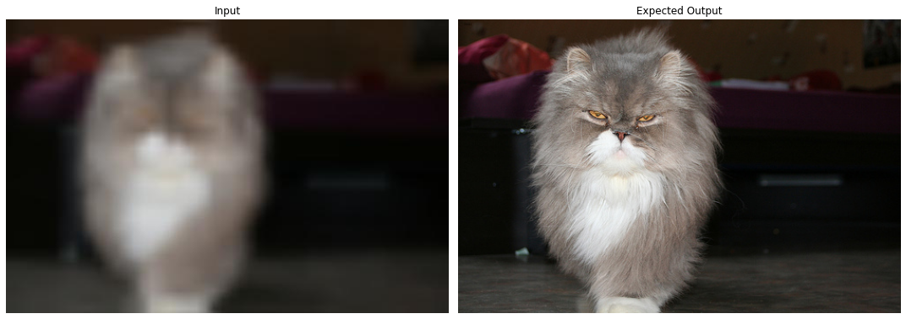

# Donna  
Donna follows the hundreds of projects using the Pix2Pix architecture for solving Image-to-Image Translation tasks. 
This tasks are incredibly varied, from conventional Pix2Pix  uses as the one presented [here](https://github.com/javirk/Person_remover)
by [javirk](https://github.com/javirk), which is used to remove people from images and videos, to this unconventional one [here](https://github.com/hmartelb/Pix2Pix-Timbre-Transfer)
by [hmartelb](https://github.com/hmartelb), transfering the timbre from audio by first transforming the audio into an image.  
Donna follows a conventional path, as we're just starting to get to know the Pix2Pix architecture, and Deep Learning for that matter. 
The idea is pretty simple, taking a bad resolution picture from a pet and translating it to one with better resolution, as the example below.  

By the way, the data comes from [The Oxford-IIIT Pet Dataset](https://www.robots.ox.ac.uk/~vgg/data/pets/), but we had to do some minor modifications in order 
to be able to use it smoothly, this modifications are shown in the [rotenning images script](https://github.com/RicFraga/Donna/blob/main/Creating%20dataset/Rotting%20Images.ipynb).  

